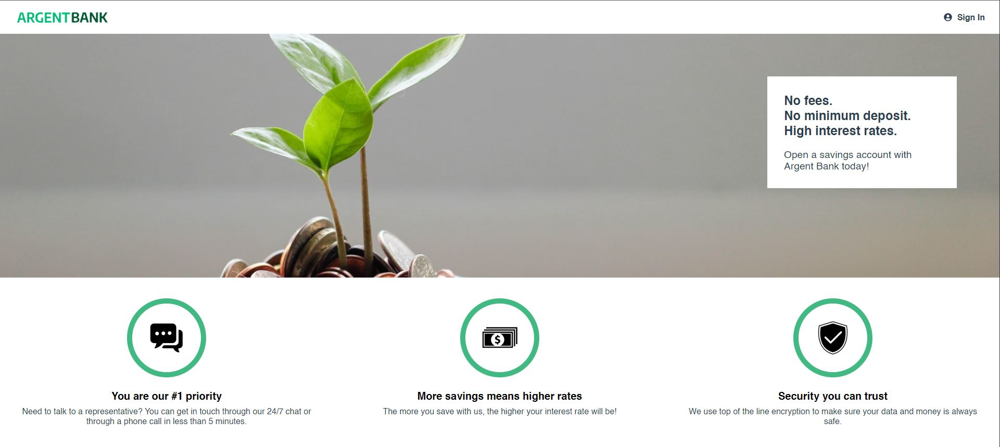

# Project #13 - Argent Bank API

<p align="center">
  
</p>

The goal of the Argent Bank project is to create the complete and responsive web application with React and use Redux to manage the state of the whole application.
The project concerns a new start-up bank, Argent Bank, which is trying to break into the sector and which needs help to set up its application.

## Getting Started

### Prerequisites

Argent Bank uses the following tech stack:

- [Node.js v12](https://nodejs.org/en/)
- [MongoDB Community Server](https://www.mongodb.com/try/download/community)

Please make sure you have the right versions and download both packages. You can verify this by using the following commands in your terminal:

```bash
# Check Node.js version
node --version

# Check Mongo version
mongo --version
```

### For the Front-end

- NodeJS (version 16.14.2)
- React & React-dom (version 18.2.0)
- React-icons (version 4.7.1)
- Sass (version 1.56.2)
- Axios (version 1.2.2)
- Js Doc (version 4.0.0)
- Dotenv (version 16.0.3)
- React Redux (version 8.0.5)
- React Redux Toolkit (version 1.9.1)
- PropTypes (version 15.8.1)

### WARNING, if you use Windows 10, and you have this error :

```
Error when deploying react app and it keeps sayings << Plugin "react" was conflicted between "package.json » eslint-config-react-app » >>

Change the name of the Folder ArgentBank to argentbank
```

Link solution : https://stackoverflow.com/questions/70377211/error-when-deploying-react-app-and-it-keeps-sayings-plugin-react-was-confli

### Instructions

1. Fork this repo
1. Clone the repo onto your computer
1. Open a terminal window in the cloned project
1. Run the following commands:

### BACK-END

```bash
# Directory
cd back-end

# Install dependencies
npm install

# Start local dev server
npm run dev:server

# Populate database with two users
npm run populate-db
```

Your server should now be running at http://locahost:3001 and you will now have two users in your MongoDB database!

### FRONT-END

```bash
# Directory
cd front-end

# Install dependencies
npm install

# Start Live Server
npm start
```

The app should now be running at http://localhost:3000

## Populated Database Data

Once you run the `populate-db` script, you should have two users in your database:

### Tony Stark

- First Name: `Tony`
- Last Name: `Stark`
- Email: `tony@stark.com`
- Password: `password123`

### Steve Rogers

- First Name: `Steve`,
- Last Name: `Rogers`,
- Email: `steve@rogers.com`,
- Password: `password456`

## API Documentation

To learn more about how the API works, once you have started your local environment, you can visit: http://localhost:3001/api-docs

## Design Assets

Static HTML and CSS has been created for most of the site and is located in: `/designs`.

For some of the dynamic features, like toggling user editing, there is a mock-up for it in `/designs/wireframes/edit-user-name.png`.

And for the API model that you will be proposing for transactitons, the wireframe can be found in `/designs/wireframes/transactions.png`.
